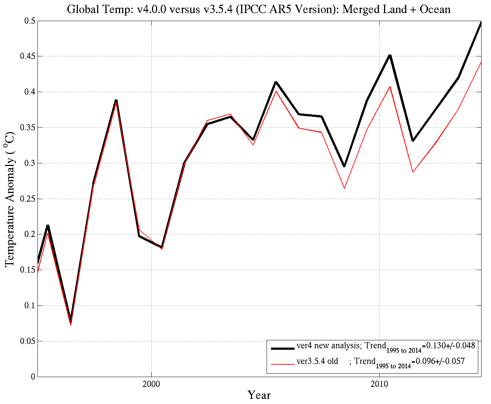

**=============Gridded Datasets=============**

1. **CRUTEM (monthly, global, 5x5 deg)**

	> 	* Gridded Products: [click here!](https://crudata.uea.ac.uk/cru/data/temperature/)
	

    

	

	>	* Station data: [click here!](https://crudata.uea.ac.uk/cru/data/temperature/crutem4/station-data.htm)
	>	* Gridder code (Perl script): [click here!](https://www.metoffice.gov.uk/binaries/content/assets/mohippo/zip/climate/gridding_and_averaging_code.zip)

1.	**CRU TS (monthly, global, 0.5x0.5 deg)**
	
	>	* Gridded Products: [click here!](https://crudata.uea.ac.uk/cru/data/hrg/)

1.	**Berkeley Earth (monthly, global, 1x1 deg)**
	>	* Gridded Products: [click here!](http://berkeleyearth.org/data/)
	>	* Source code: [click here!] (http://berkeleyearth.org/analysis-code/)

1. **NASA/GISS TEMP (monthly, global, 2x2 deg)**

	>	* Gridded Products:
	>		* Standard (1200km smoothing): [click here!](https://data.giss.nasa.gov/pub/gistemp/gistemp1200_ERSSTv5.nc.gz)
	>		* non-Standard (250km smoothing, land only): [click here!](https://data.giss.nasa.gov/pub/gistemp/gistemp250.nc.gz)
	>	* Station data: [click here!](https://data.giss.nasa.gov/gistemp/stdata/v3.mean_GISS_homogenized.zip) or [click here for visual selection](https://data.giss.nasa.gov/gistemp/stdata/)
	>	* Source code: [click here!](https://data.giss.nasa.gov/gistemp/sources_v3/)

1. **GHCN Gridded Products (monthly, global, 5x5 deg)**
	>	* Data: [click here!](https://www.ncdc.noaa.gov/temp-and-precip/ghcn-gridded-products/)

1. **MLOST Product (monthly, global, 5x5 deg)**
	>	* Data: [click here!]()
	

    

	

	
**=============Station Datasets=============**

1.	**Global Historical Climatology Network (GHCN, monthly&daily, global)**

	>	* Data access: [click here!](https://www.ncdc.noaa.gov/data-access/land-based-station-data/land-based-datasets/global-historical-climatology-network-ghcn)

1.	**U.S. Climate Reference Network (USRCRN, monthly, daily, hourly, sub-hourly, conterminous U.S.)**
	>	* Data access: [click here!](https://www.ncdc.noaa.gov/crn/qcdatasets.html)

1.	**FLUXNET (register required)**
	>	* Link: [click here!](http://fluxnet.fluxdata.org/data/)

1.	**Russian & former USSR Station data (daily, Russia)**
	>	* Russia: [click here!](http://cdiac.ess-dive.lbl.gov/ftp/russia_daily/)
	>	* USSR: [click here!](http://cdiac.ess-dive.lbl.gov/ftp/ndp040/)
	
**=============Maps=============**

1. **Koppen Climate Classification**
	
	* Hanschen: [click here!](http://hanschen.org/koppen/)
	* Kottek: [click here!](http://koeppen-geiger.vu-wien.ac.at/present.htm)
	* Peel: [click here!](https://www.hydrol-earth-syst-sci.net/11/1633/2007/hess-11-1633-2007-supplement.zip)
	
1. **Permafrost map**

	>	* NH IPA: [NSIDC FTP](ftp://sidads.colorado.edu/pub/DATASETS/fgdc/ggd318_map_circumarctic/)
	>	* China: [NSIDC FTP](ftp://sidads.colorado.edu/pub/DATASETS/fgdc/ggd603_pf_maps_china/)
	>	* Russia: [NSIDC FTP](ftp://sidads.colorado.edu/pub/DATASETS/fgdc/ggd600_russia_pf_maps/)